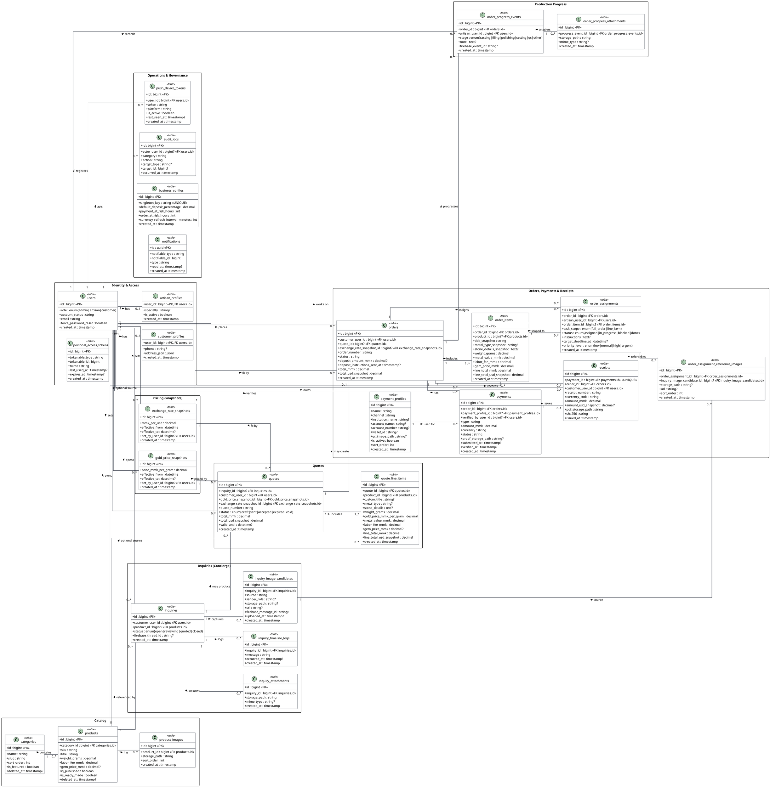

# Shwe Eain Jewelry Hub — Database Class Diagram (ERD Style)

The following is a **technical ERD-style class diagram** (PlantUML) showing the core database architecture.

```plantuml
@startuml shwe_eain_jewelry_hub_database_erd

' =========================================================
' Shwe Eain Jewelry Hub — Database Architecture (ERD style)
' - UML class diagram used to represent tables (<<table>>)
' - Includes primary keys (PK) and main foreign keys (FK)
' - Uses UML multiplicities: 1, 0..1, 0..*, 1..*
' =========================================================

left to right direction
hide methods
skinparam shadowing false
skinparam packageStyle rectangle
skinparam classAttributeIconSize 0
skinparam linetype ortho
skinparam class {
  BackgroundColor #FFFFFF
  BorderColor #111827
  ArrowColor #111827
}

package "Identity & Access" {
  class users <<table>> {
    +id : bigint <<PK>>
    --
    +role : enum(admin|artisan|customer)
    +account_status : string
    +email : string
    +force_password_reset : boolean
    +created_at : timestamp
  }

  class customer_profiles <<table>> {
    +user_id : bigint <<PK, FK users.id>>
    --
    +phone : string?
    +address_json : json?
    +created_at : timestamp
  }

  class artisan_profiles <<table>> {
    +user_id : bigint <<PK, FK users.id>>
    --
    +specialty : string?
    +is_active : boolean
    +created_at : timestamp
  }

  class personal_access_tokens <<table>> {
    +id : bigint <<PK>>
    --
    +tokenable_type : string
    +tokenable_id : bigint
    +name : string
    +last_used_at : timestamp?
    +expires_at : timestamp?
    +created_at : timestamp
  }
}

package "Catalog" {
  class categories <<table>> {
    +id : bigint <<PK>>
    --
    +name : string
    +slug : string
    +sort_order : int
    +is_featured : boolean
    +deleted_at : timestamp?
  }

  class products <<table>> {
    +id : bigint <<PK>>
    --
    +category_id : bigint <<FK categories.id>>
    +sku : string
    +title : string
    +weight_grams : decimal
    +labor_fee_mmk : decimal
    +gem_price_mmk : decimal?
    +is_published : boolean
    +is_ready_made : boolean
    +deleted_at : timestamp?
  }

  class product_images <<table>> {
    +id : bigint <<PK>>
    --
    +product_id : bigint <<FK products.id>>
    +storage_path : string
    +sort_order : int
    +created_at : timestamp
  }
}

package "Pricing (Snapshots)" {
  class gold_price_snapshots <<table>> {
    +id : bigint <<PK>>
    --
    +price_mmk_per_gram : decimal
    +effective_from : datetime
    +effective_to : datetime?
    +set_by_user_id : bigint? <<FK users.id>>
    +created_at : timestamp
  }

  class exchange_rate_snapshots <<table>> {
    +id : bigint <<PK>>
    --
    +mmk_per_usd : decimal
    +effective_from : datetime
    +effective_to : datetime?
    +set_by_user_id : bigint? <<FK users.id>>
    +created_at : timestamp
  }
}

package "Inquiries (Concierge)" {
  class inquiries <<table>> {
    +id : bigint <<PK>>
    --
    +customer_user_id : bigint <<FK users.id>>
    +product_id : bigint? <<FK products.id>>
    +status : enum(open|reviewing|quoted|closed)
    +firebase_thread_id : string?
    +created_at : timestamp
  }

  class inquiry_attachments <<table>> {
    +id : bigint <<PK>>
    --
    +inquiry_id : bigint <<FK inquiries.id>>
    +storage_path : string
    +mime_type : string?
    +created_at : timestamp
  }

  class inquiry_timeline_logs <<table>> {
    +id : bigint <<PK>>
    --
    +inquiry_id : bigint <<FK inquiries.id>>
    +message : string
    +occurred_at : timestamp?
    +created_at : timestamp
  }

  class inquiry_image_candidates <<table>> {
    +id : bigint <<PK>>
    --
    +inquiry_id : bigint <<FK inquiries.id>>
    +source : string
    +sender_role : string?
    +storage_path : string?
    +url : string?
    +firebase_message_id : string?
    +uploaded_at : timestamp?
    +created_at : timestamp
  }
}

package "Quotes" {
  class quotes <<table>> {
    +id : bigint <<PK>>
    --
    +inquiry_id : bigint? <<FK inquiries.id>>
    +customer_user_id : bigint <<FK users.id>>
    +gold_price_snapshot_id : bigint <<FK gold_price_snapshots.id>>
    +exchange_rate_snapshot_id : bigint <<FK exchange_rate_snapshots.id>>
    +quote_number : string
    +status : enum(draft|sent|accepted|expired|void)
    +total_mmk : decimal
    +total_usd_snapshot : decimal
    +valid_until : datetime?
    +created_at : timestamp
  }

  class quote_line_items <<table>> {
    +id : bigint <<PK>>
    --
    +quote_id : bigint <<FK quotes.id>>
    +product_id : bigint? <<FK products.id>>
    +custom_title : string?
    +metal_type : string?
    +stone_details : text?
    +weight_grams : decimal
    +gold_price_mmk_per_gram : decimal
    +metal_value_mmk : decimal
    +labor_fee_mmk : decimal
    +gem_price_mmk : decimal?
    +line_total_mmk : decimal
    +line_total_usd_snapshot : decimal
    +created_at : timestamp
  }
}

package "Orders, Payments & Receipts" {
  class orders <<table>> {
    +id : bigint <<PK>>
    --
    +customer_user_id : bigint <<FK users.id>>
    +quote_id : bigint? <<FK quotes.id>>
    +exchange_rate_snapshot_id : bigint? <<FK exchange_rate_snapshots.id>>
    +order_number : string
    +status : string
    +deposit_amount_mmk : decimal?
    +deposit_instructions_sent_at : timestamp?
    +total_mmk : decimal
    +total_usd_snapshot : decimal
    +created_at : timestamp
  }

  class order_items <<table>> {
    +id : bigint <<PK>>
    --
    +order_id : bigint <<FK orders.id>>
    +product_id : bigint? <<FK products.id>>
    +title_snapshot : string
    +metal_type_snapshot : string?
    +stone_details_snapshot : text?
    +weight_grams : decimal
    +metal_value_mmk : decimal
    +labor_fee_mmk : decimal
    +gem_price_mmk : decimal?
    +line_total_mmk : decimal
    +line_total_usd_snapshot : decimal
    +created_at : timestamp
  }

  class order_assignments <<table>> {
    +id : bigint <<PK>>
    --
    +order_id : bigint <<FK orders.id>>
    +artisan_user_id : bigint <<FK users.id>>
    +order_item_id : bigint? <<FK order_items.id>>
    +task_scope : enum(full_order|line_item)
    +status : enum(assigned|in_progress|blocked|done)
    +instructions : text?
    +target_deadline_at : datetime?
    +priority_level : enum(low|normal|high|urgent)
    +created_at : timestamp
  }

  class order_assignment_reference_images <<table>> {
    +id : bigint <<PK>>
    --
    +order_assignment_id : bigint <<FK order_assignments.id>>
    +inquiry_image_candidate_id : bigint? <<FK inquiry_image_candidates.id>>
    +storage_path : string?
    +url : string?
    +sort_order : int
    +created_at : timestamp
  }

  class payments <<table>> {
    +id : bigint <<PK>>
    --
    +order_id : bigint <<FK orders.id>>
    +payment_profile_id : bigint? <<FK payment_profiles.id>>
    +verified_by_user_id : bigint? <<FK users.id>>
    +type : string
    +amount_mmk : decimal
    +currency : string
    +status : string
    +proof_storage_path : string?
    +submitted_at : timestamp?
    +verified_at : timestamp?
    +created_at : timestamp
  }

  class payment_profiles <<table>> {
    +id : bigint <<PK>>
    --
    +name : string
    +channel : string
    +institution_name : string?
    +account_name : string?
    +account_number : string?
    +wallet_id : string?
    +qr_image_path : string?
    +is_active : boolean
    +sort_order : int
    +created_at : timestamp
  }

  class receipts <<table>> {
    +id : bigint <<PK>>
    --
    +payment_id : bigint <<FK payments.id>> <<UNIQUE>>
    +order_id : bigint <<FK orders.id>>
    +customer_user_id : bigint <<FK users.id>>
    +receipt_number : string
    +currency_code : string
    +amount_mmk : decimal
    +amount_usd_snapshot : decimal?
    +pdf_storage_path : string
    +sha256 : string
    +issued_at : timestamp
  }
}

package "Production Progress" {
  class order_progress_events <<table>> {
    +id : bigint <<PK>>
    --
    +order_id : bigint <<FK orders.id>>
    +artisan_user_id : bigint <<FK users.id>>
    +stage : enum(casting|filing|polishing|setting|qc|other)
    +note : text?
    +firebase_event_id : string?
    +created_at : timestamp
  }

  class order_progress_attachments <<table>> {
    +id : bigint <<PK>>
    --
    +progress_event_id : bigint <<FK order_progress_events.id>>
    +storage_path : string
    +mime_type : string?
    +created_at : timestamp
  }
}

package "Operations & Governance" {
  class push_device_tokens <<table>> {
    +id : bigint <<PK>>
    --
    +user_id : bigint <<FK users.id>>
    +token : string
    +platform : string
    +is_active : boolean
    +last_seen_at : timestamp?
    +created_at : timestamp
  }

  class audit_logs <<table>> {
    +id : bigint <<PK>>
    --
    +actor_user_id : bigint? <<FK users.id>>
    +category : string
    +action : string
    +target_type : string?
    +target_id : bigint?
    +occurred_at : timestamp
  }

  class business_configs <<table>> {
    +id : bigint <<PK>>
    --
    +singleton_key : string <<UNIQUE>>
    +default_deposit_percentage : decimal
    +payment_at_risk_hours : int
    +order_at_risk_hours : int
    +currency_refresh_interval_minutes : int
    +created_at : timestamp
  }

  class notifications <<table>> {
    +id : uuid <<PK>>
    --
    +notifiable_type : string
    +notifiable_id : bigint
    +type : string
    +read_at : timestamp?
    +created_at : timestamp
  }
}

' =========================================================
' Relationships (with UML multiplicities)
' =========================================================

users "1" -- "0..1" customer_profiles : has >
users "1" -- "0..1" artisan_profiles : has >

categories "1" -- "0..*" products : contains >
products "1" -- "0..*" product_images : has >

users "1" -- "0..*" inquiries : opens >
products "1" -- "0..*" inquiries : referenced by >
inquiries "1" -- "0..*" inquiry_attachments : includes >
inquiries "1" -- "0..*" inquiry_timeline_logs : logs >
inquiries "1" -- "0..*" inquiry_image_candidates : captures >

inquiries "1" -- "0..*" quotes : may produce >
users "1" -- "0..*" quotes : owns >
gold_price_snapshots "1" -- "0..*" quotes : priced by >
exchange_rate_snapshots "1" -- "0..*" quotes : fx by >
quotes "1" -- "1..*" quote_line_items : includes >
products "1" -- "0..*" quote_line_items : optional source >

users "1" -- "0..*" orders : places >
quotes "1" -- "0..1" orders : may create >
exchange_rate_snapshots "1" -- "0..*" orders : fx by >
orders "1" -- "1..*" order_items : includes >
products "1" -- "0..*" order_items : optional source >

orders "1" -- "0..*" payments : has >
payment_profiles "1" -- "0..*" payments : used for >
users "1" -- "0..*" payments : verifies >
payments "1" -- "0..1" receipts : issues >
orders "1" -- "0..*" receipts : records >
users "1" -- "0..*" receipts : owns >

orders "1" -- "0..*" order_assignments : assigns >
users "1" -- "0..*" order_assignments : works on >
order_items "1" -- "0..*" order_assignments : scoped to >
order_assignments "1" -- "0..*" order_assignment_reference_images : references >
inquiry_image_candidates "1" -- "0..*" order_assignment_reference_images : source >

orders "1" -- "0..*" order_progress_events : progresses >
users "1" -- "0..*" order_progress_events : records >
order_progress_events "1" -- "0..*" order_progress_attachments : attaches >

users "1" -- "0..*" push_device_tokens : registers >
users "1" -- "0..*" audit_logs : acts >
users "1" -- "0..*" gold_price_snapshots : sets >
users "1" -- "0..*" exchange_rate_snapshots : sets >

@enduml
```

